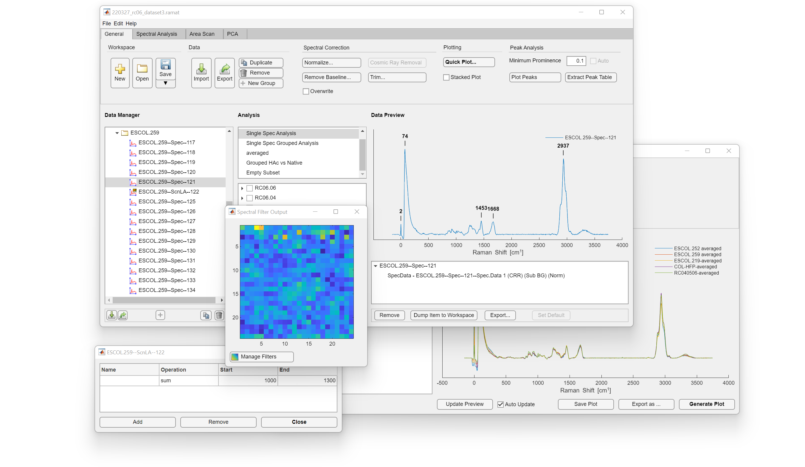
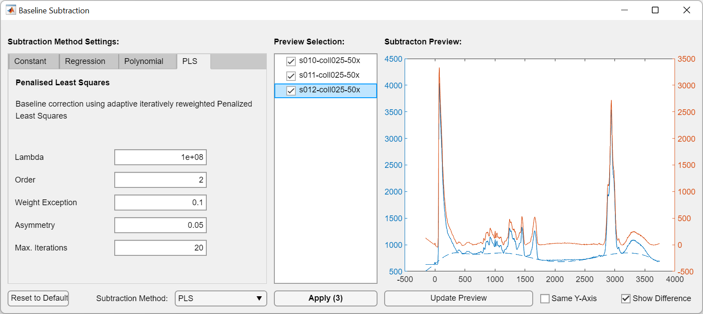

# RaMAT
**RaMAT** is a MATLAB-based software package for quick analysis, spectral correction, and plotting of spectroscopical Raman data.
Data can be imported straight from WiTEC software or as one of the many supported ASCII formats.



# Requirements
**Minimal Requirements:**
* MATLAB 2021a or newer *(might display minor bugs in the graphical user interface)*

**Recommended Requirements:**
* MATLAB 2022a or newer
* Bioinformatics Toolbox, *required for: baseline correction*
* Statistics and Machine Learning Toolbox, *required for: PCA, t-SNE*
* Signal Processing Toolbox, *required for: peak analysis*

# Structure

Projects are contained within the ```Project``` class. Data will be appended to one of the group folders underneath ```Project.data_root```.

# Quick Start

## Starting RaMAT

**RaMAT** can be run through MATLAB's command line interface (CLI) or through the provided graphical user interface (GUI).
1. To start **RaMAT**, run the following command in MATLAB's CLI:

    ```MATLAB
    ramat
    ```

    Do *not* start `ramatgui.mlapp` directly.
    
2. If you haven't installed the WITio Toolbox (by Joonas T. Holmi), you'll be asked to install it before proceeding. **RaMAT** can be used without the WITio Toolbox, however, you'll be unable to directly import data from the WiTEC's software package.

    For more information on the WITio Toolbox by Joonas T. Holmi, visit the [repository page on GitLab](https://gitlab.com/jtholmi/wit_io).

## Importing Data

Through GUI:
1. Data can be imported through the top ribbon toolbar: `General` > `Data` > `Import` or through the top menu: `File` > `Import Data`. A dialog will be opened.
2. Select `WITec` > `Select Files`
3. Optional: Check **Append to currently loaded data set**, if you want to retain the already imported data.
4. Select `Confirm`.

Using CLI:
1. Ensure a project is initialized in the base workspace as ``prj``.
2. Import data
    
    ```prj.import_data(path="", **kwargs);```

    Without any optional arguments, e.g. ``prj.import_data``, you will be prompted to select the .wip file and the default import options will be used.


## Managing Data

Every measurement is stored as a DataItem within a DataContainer. These DataContainers will be displayed in the **Data Manager**. Data will be appended to one of the group folders underneath ```Project.data_root```.

To display data in the CLI, the group folders (or their content) can be outputted to a table:
```MATLAB
table(prj.data_root) % output information on the root folder
table(prj.data_root.child_group(1).children(:)) % output everything in the first group
```
To display all data:
```MATLAB
table(prj.DataSet)
```

The output can also be assigned to a variable in the base workspace for quick data manipulation through MATLAB's CLI.
```MATLAB
% Assign first 5 measurements to a variable
newgroup = prj.data_root.child_group(1).children(1:5);
```

Manipulated data does not have to be stored back into the project, as all data class are *handle classes*. For more information on *handle classes*, please refer to the [MATLAB Documentation page on handle classes](https://nl.mathworks.com/help/matlab/handle-classes.html).

### Working in the Data Manager

Imported data will be shown as DataContainers under *Data Root* > *New Import*. You can rename the name of the folders anything you want. The Data Manager allows you to rename, duplicate, or remove individual measurements. Right-clicking any of the DataContainers will present a context menu based on the selected DataContainers.


To preview the data stored within the DataContainers in the **Data Preview** pane, simply click the measurement. A DataContainer can contain the following DataItems:
* **SpecData**: Spectral Raman data with spatial information; either a single spectrum or a large-area scan
* **SpectrumSimple**: Spectral data without spatial information, e.g. an extracted loadings plot.
* **TextData**: Plain-text data
* **ImageData**: An image; either an extracted bitmap or a stitched video image exported by WiTEC's Project FIVE.
* **SpecFilter**: Spectral filter
* **Mask**
* **PeakTable**

## Data Correction

### Baseline Subtraction

1. Select measurements (hold CTRL to select multiple measurements)
2. Under Spectral Correction, select `Remove Baseline...`. This will open a new dialog.
3. Select a baseline subtraction method, preview the results, and confirm with `Apply`.



## Data Analysis

### Principal Component Analysis

1. Create Spectral Analysis
    1. Select measurements (hold CTRL to select multiple measurements)
    2. Add measurements to an Analysis Subset by *Right Click* > `Add to New Analysis`.
2. Group and Select Measurements
    1. In the lower Analysis pane, assign the measurements groups.
    2. Select measurements/groups to be analysed
3. Create Principal Component Analysis
    1. Create new principal component analysis under `Spectral Analysis` > `Principal Component Analysis`
    2. Define the range for the PCA.
    3. Select `Create new PCA`
    4. A new PCA will be shown in the **Data Manager** under *Analysis Results*.
